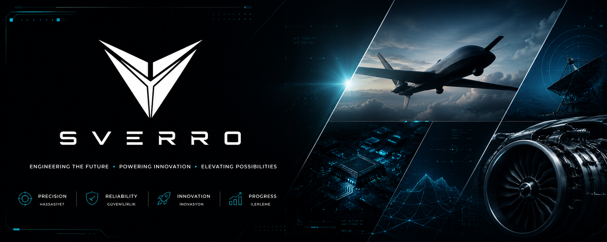

 

<h2 align="center">About</h2>

SVERRO is an engineering organization working across hardware, software and applied research. Our teams create production-ready products, reusable libraries and open technical knowledge.

Our focus is simple: **build useful systems, solve difficult problems and document what we learn.**

<h2 align="center">Technology</h2>

<table width="100%">
<tr>
<td width="33%" valign="top" align="center">

**Languages**

 

</td>
<td width="33%" valign="top" align="center">

**Embedded &amp; hardware**

 

</td>
<td width="33%" valign="top" align="center">

**Software &amp; infrastructure**

 

</td>
</tr>
</table>

<h2 align="center">Projects</h2>

<table id="projects" width="100%">
<tr>
<td width="50%" valign="top" align="center">

### 📈 PIMS

**Project Investment Management System**

Tools for evaluating projects, investments and operational outcomes with clear, structured data.

`Management` `Analytics` `Platform`

[View project →](https://github.com/sverro-dev/pims)

</td>
<td width="50%" valign="top" align="center">

### 📚 Atlas

**Engineering Knowledge Platform**

A connected workspace for organizing, discovering and maintaining technical knowledge.

`Knowledge` `Documentation` `Search`

[View project →](https://github.com/sverro-dev/atlas)

</td>
</tr>
<tr>
<td width="50%" valign="top" align="center">

### 📡 LYNK

**Communication Middleware**

Reliable communication building blocks for embedded devices, networks and software services.

`Communication` `Protocols` `Middleware`

[View project →](https://github.com/sverro-dev/lynk)

</td>
<td width="50%" valign="top" align="center">

### 🛰️ VSM

**Vector Sensing Module**

A modular sensing platform for motion, measurement and real-world data acquisition.

`Sensors` `Embedded` `Hardware`

[View project →](https://github.com/sverro-dev/vsm)

</td>
</tr>
<tr>
<td width="50%" valign="top" align="center">

### 🦋 Papilo

**Bionic Butterfly Platform**

An experimental robotics platform exploring biological flight and intelligent control.

`Robotics` `Research` `Control`

[View project →](https://github.com/sverro-dev/papilo)

</td>
<td width="50%" valign="top" align="center">

### 🧩 Libraries

**Shared Engineering Foundations**

SDKs, drivers, components and utilities shared across SVERRO projects.

`SDK` `Drivers` `Components`

[Browse repositories →](https://github.com/orgs/sverro-dev/repositories)

</td>
</tr>
</table>

<h2 align="center">Engineering</h2>

<table width="100%">
<tr>
<td width="25%" valign="top" align="center">

**📖 Standards**

Clear and repeatable engineering practices.

</td>
<td width="25%" valign="top" align="center">

**🏗️ Architecture**

Maintainable systems with explicit decisions.

</td>
<td width="25%" valign="top" align="center">

**📄 Templates**

Consistent foundations for new projects.

</td>
<td width="25%" valign="top" align="center">

**📘 Documentation**

Technical knowledge that evolves with the code.

</td>
</tr>
</table>

---

<h3 align="center">Build with us</h3>

Explore our work, follow active projects and contribute to the repositories that interest you.

[View all repositories](https://github.com/orgs/sverro-dev/repositories) · [Visit SVERRO](https://github.com/sverro-dev)

© SVERRO · Engineering Tomorrow

